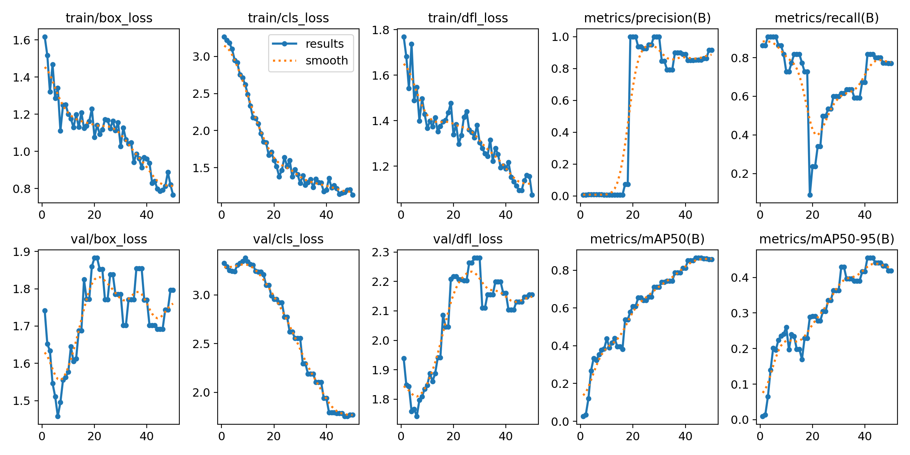
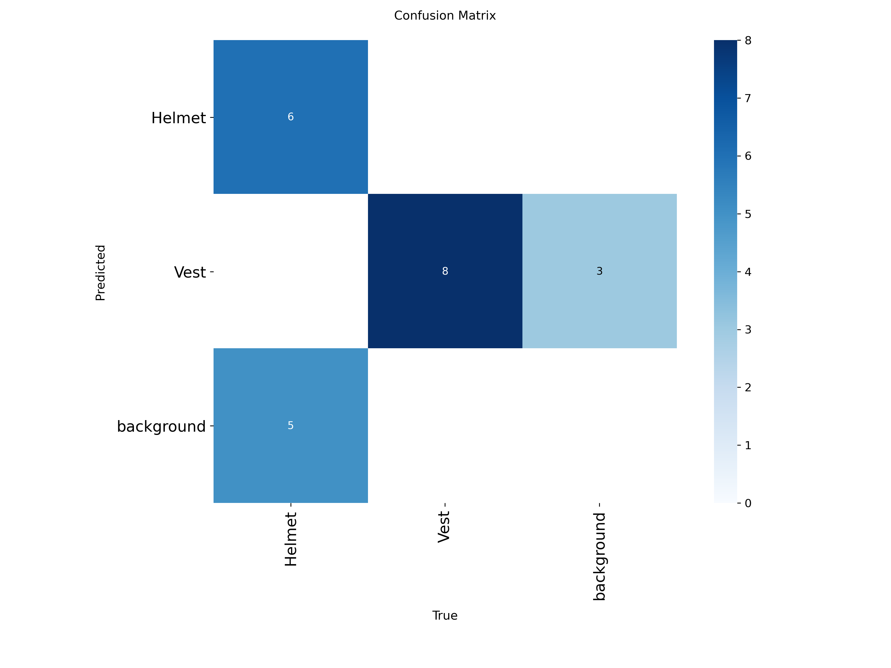
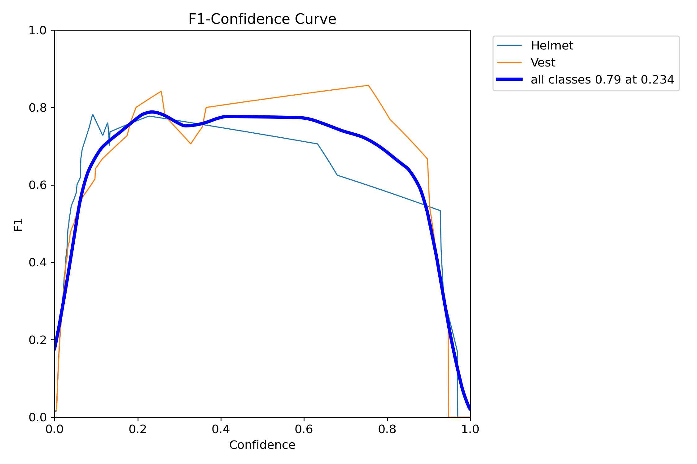
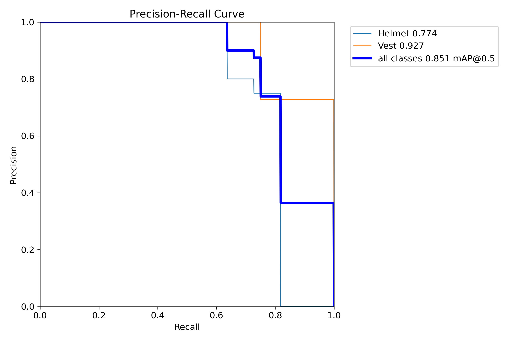

# PPEDetect - Deteksi Alat Pelindung Diri (APD) 👷‍♂️👷‍♀️

PPEDetect adalah sistem cerdas berbasis *Computer Vision* yang secara otomatis mendeteksi penggunaan Alat Pelindung Diri (APD) seperti helm keselamatan (Helmet) dan rompi proyek (Vest) dari gambar. Proyek ini dibangun menggunakan **YOLOv8** untuk mendeteksi objek secara _real-time_ dan kerangka kerja **Flask** untuk antarmuka web.

---

## 🎯 Fitur Utama

- **Deteksi Otomatis:** Mengidentifikasi secara akurat letak Helm dan Rompi pada gambar yang diunggah.
- **Validasi Kepatuhan:** Sistem akan menandai pengguna sebagai "Compliant" (Patuh) jika Helm dan Rompi terdeteksi, atau "Non-Compliant" jika ada yang kurang.
- **Antarmuka Interaktif:** UI web yang dirancang dengan desain modern, menyertakan *dashboard* statistik hasil pemindaian dan riwayat.
- **Catatan Database:** Setiap hasil pindaian akan disimpan dalam *database* (SQLite) untuk pencatatan dan pelaporan kepatuhan.

---

## 📊 Hasil Evaluasi Training YOLOv8

Model deteksi telah dilatih (di-*training*) menggunakan metode YOLOv8 dan menghasilkan evaluasi akurasi yang sangat baik. Berikut adalah beberapa metrik dan grafik hasil pelatihan dari model ini:

### 1. Training Results (Loss & Metrics)
Grafik di bawah ini menunjukkan metrik *loss* (kerugian) yang semakin menurun seiring berjalannya iterasi (epoch), serta peningkatan mAP (mean Average Precision) yang membuktikan model belajar dengan baik:



### 2. Confusion Matrix
*Confusion Matrix* memberikan gambaran tentang sejauh mana model tepat mengenali (True Positive) dan seberapa sering model keliru menebak (False Positive / False Negative) untuk kelas `Helmet`, `Vest`, atau `Background`.



### 3. F1-Confidence Curve
Kurva F1 (F1-score terhadap *confidence threshold*) merepresentasikan keseimbangan antara tingkat Presisi (Precision) dan Rekal (Recall). Titik puncak kurva ini adalah titik *threshold* terbaik untuk model agar dapat mendeteksi APD seakurat mungkin.



### 4. Precision-Recall Curve (PR Curve)
Kurva PR menunjukkan hubungan *Precision* dan *Recall* pada berbagai tingkat threshold. Luas area di bawah kurva (mAP) yang mendekati 1.0 menunjukkan bahwa deteksi yang dihasilkan sangat solid.



---

## 🛠️ Teknologi yang Digunakan

- **AI & Computer Vision:** Ultralytics YOLOv8, PyTorch, OpenCV
- **Backend Framework:** Python Flask
- **Frontend:** HTML5, Vanilla CSS, JavaScript
- **Database:** SQLite

---

## 🚀 Cara Menjalankan Aplikasi

1. **Persiapan Environtment**
   Pastikan Anda sudah menginstal Python (>= 3.9). Sangat disarankan untuk menggunakan _virtual environment_.
   ```bash
   python -m venv venv
   source venv/Scripts/activate  # Untuk Windows
   ```

2. **Instalasi Dependencies**
   Instal library yang diperlukan:
   ```bash
   pip install -r requirements.txt
   ```

3. **Jalankan Aplikasi Web**
   Mulai server web lokal Flask:
   ```bash
   python app.py
   ```
   Aplikasi akan berjalan pada `http://127.0.0.1:5000/`.

---
*Dibuat oleh Gadiza Fauzi*